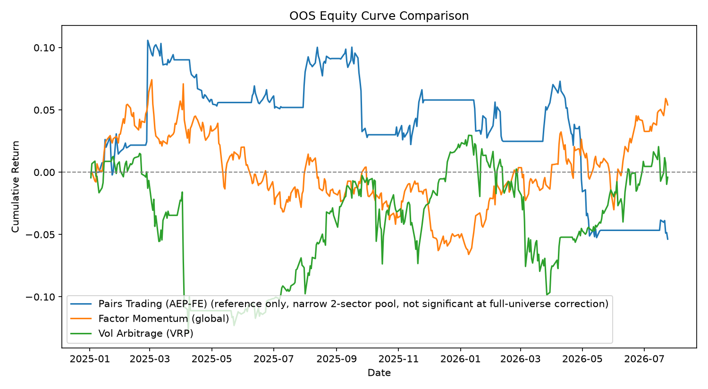
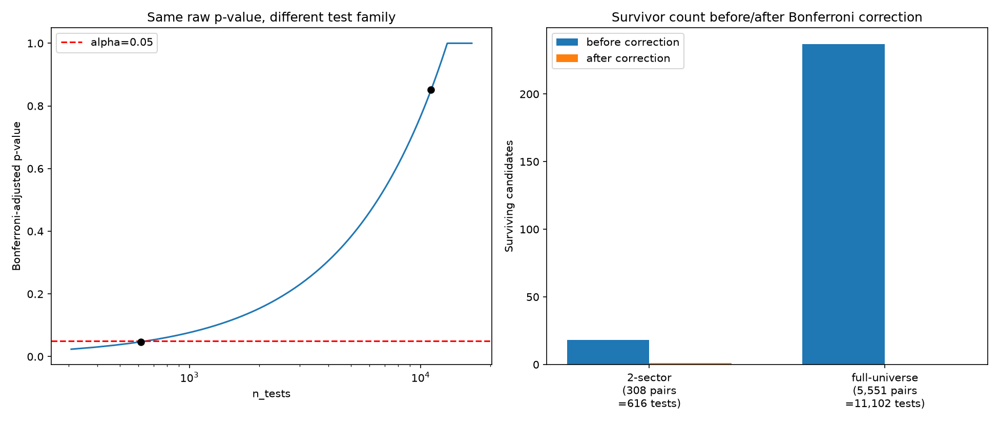
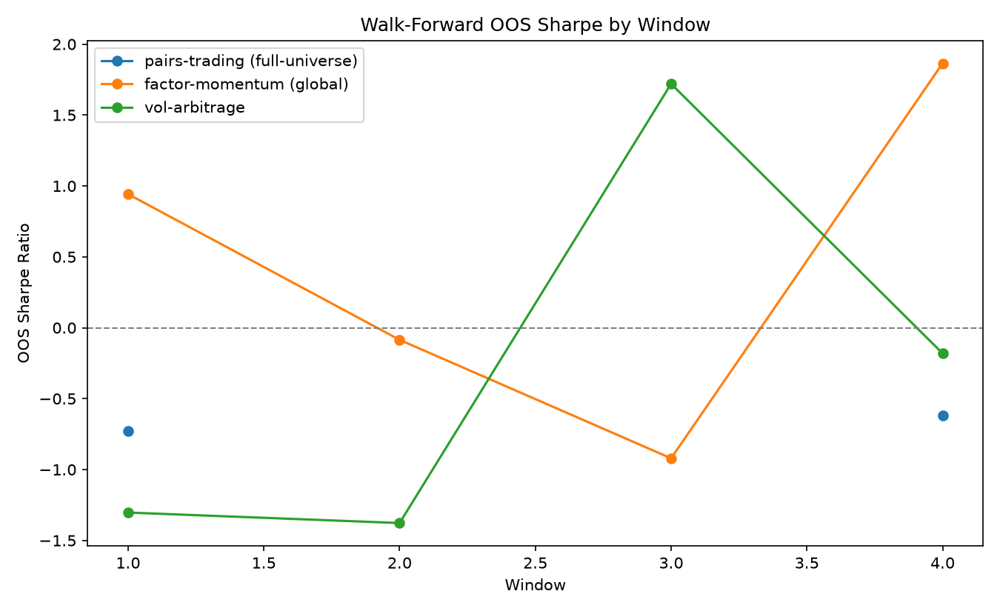
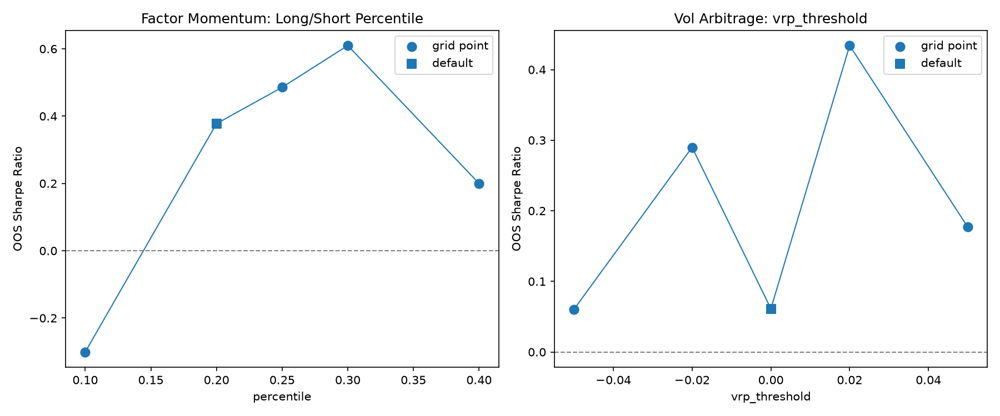
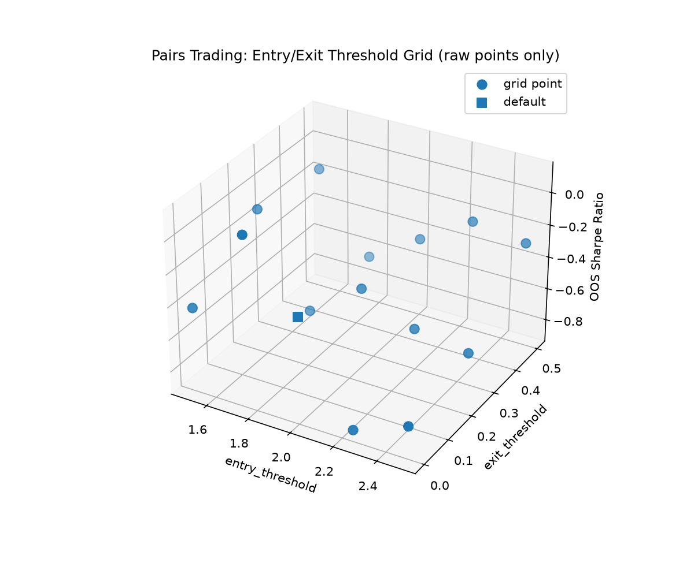

# strategy-lab


[](https://codecov.io/gh/oimosanAI/strategy-lab)


[](LICENSE)


<!-- tests badge is static -- update the count manually (`poetry run pytest -q`) whenever new tests are added -->

## 1. プロジェクト概要

クオンツ・リスク管理職種への応募を意図した技術ポートフォリオ。単一戦略の実装ではなく、**複数戦略を統一的なバックテスト・評価基盤の上で比較検証できるフレームワーク**として設計した。ペアトレード（統計的裁定）とマルチファクター（モメンタム＋低ボラティリティ）の2戦略を、look-ahead biasのないバックテストエンジン・統計的有意性検定・取引コストを織り込んだ評価指標の上に実装し、S&P 500の実データでEnd-to-Endの動作検証を行った。

詳細な要件定義は[REQUIREMENTS.md](REQUIREMENTS.md)を参照。

## 2. 設計思想の核

- **Look-ahead biasの二重防御**：時点tの意思決定はt以前の情報のみに依存するという制約を、(a) `EXECUTION_LAG`をエンジンの1箇所だけに適用する構造的な仕組みと、(b) 未来の価格を摂動させても過去の意思決定が変化しないことを実際に検証する性質ベースの検証（`assert_causal`）の二重で担保する。
- **検証ツール自体の正しさも検証する**：ガードや統計検定は「意図通りに通ること」だけでなく「実際に不正な実装を捕まえられること」を、意図的に壊した負の対照実装を用いて確認する。ガードが通ることだけを確認しても、そのガードが機能している証拠にはならないという前提に立つ。
- **実データ検証で見つかった問題は隠さず記録する**：ユニットテストでは原理的に検出できない、実データ特有の問題（統計的検定の前提、ポジションサイジングのスケール等）が見つかった場合、それを解決した上で経緯・原因・教訓をコードと同じ場所に記録し、都合の良い結果だけを残さない。

## 3. 主要な発見

Phase 3の実データE2E検証では、いずれもユニットテストの粒度では検出できない、実運用に直結する問題を発見した。



上図：3戦略のOOS区間の累積リターンを実データで重ね書きしたもの。pairs_trading（AEP-FE）は狭い2セクタープールでの参考情報であり、全宇宙補正では統計的に有意でない（凡例に明記）。3戦略のいずれも安定して右肩上がりではなく、以下で述べる個別の発見と整合する。軸は3系列とも共通スケール（0%起点）で、恣意的な拡大・縮小は行っていない。生成スクリプト：[scripts/generate_figures.py](scripts/generate_figures.py)。

### 3-1. 多重検定問題（ペアトレード）

候補ペアのスクリーニングにおいて、検定対象を2セクター（54銘柄）に限定した場合と、全11セクター（503銘柄）に拡張した場合とで、統計的結論が反転する現象を実データで確認した。

| 検定範囲 | 検定数（n_tests） | 生存ペア数（Bonferroni補正後） |
|---|---|---|
| 2セクター（54銘柄） | 308 | 1（AEP-FE） |
| 全宇宙（495銘柄） | 5,551 | **0** |

同一の生データ・同一の生p値（7.666e-05）が、検定族の定義次第で「有意」（adjusted p=0.024）にも「有意でない」（adjusted p=0.43）にもなる。「候補プールを広げれば良いペアが見つかりやすくなる」という直感は、多重検定補正の厳格化と正面から相殺するという教訓を、実データで定量的に示した。



左図：同一の生p値に対し、検定数（n_tests）が増えるほどBonferroni補正後のp値が上昇し、alpha=0.05の基準を跨いで「有意」から「有意でない」へ反転する様子。右図：補正前後の生存ペア数の対比（2セクター：18→1、全宇宙：237→0）。詳細は[strategies/pairs_trading/README.md](strategies/pairs_trading/README.md)。

### 3-2. ポジションサイジングのスケール見落とし（マルチファクター）

約100銘柄のロング・約100銘柄のショートを同時に保有するクロスセクショナル戦略を初めて実データで実行したところ、ポートフォリオ全体のgross exposureが最大56倍に達し、日次リターンが-126%、累積エクイティカーブがほぼゼロまで低下するという、数学的に不可能な数値が出力された。原因はlook-ahead biasではなく、既存のポジションサイジング機構（`VolTargetSizer`）が銘柄単位のレバレッジ上限のみを持ち、ポートフォリオ全体のエクスポージャーには何の制約もなかったこと——2銘柄構成のペアトレードでは顕在化しなかった設計ギャップだった。

| | 修正前 | 修正後 |
|---|---|---|
| Gross exposure（中央値/最大） | 39.9x / 56.3x | 1.20x / 1.48x |
| max_drawdown | -100.02%（数学的に無意味） | -12.52%（妥当） |

「非現実的に良すぎる数値」だけでなく「数学的に不可能なほど悪い数値」も、look-ahead bias以外の設計層（ポジションサイジング・ポートフォリオ構築）を疑う調査対象であるべき、という一般化可能な教訓を得た。この時点では`check_exposure_limits()`をE2Eスクリプト内で明示的に呼び出すだけの一回限りの対応だったが、後日`run_backtest()`自体に恒久的に組み込み、全戦略共通のデフォルトとして強制化した（§6参照）。詳細は[strategies/factor_momentum/README.md](strategies/factor_momentum/README.md)。

### 3-3. セクター中立化：設計目的の達成とバックテスト成績のトレードオフ

マルチファクター戦略にセクター中立化（セクターごとにquintileを構築し、セクター間で均等な予算配分を行う設計）を追加実装し、globalモード（全宇宙横断のクロスセクショナル）と実データで比較した。

| | Global | Sector-Neutral |
|---|---|---|
| セクター別net exposureのstd | 0.0757 | **0.0206**（約1/3.7） |
| OOS Sharpe | 0.44 | 0.03 |
| IS→OOS劣化 | 0.24 | **1.44** |

セクター集中抑制という設計目的自体は明確に達成された（セクター別net exposureのばらつきが約1/3.7に縮小）。しかし副作用として、IS→OOS劣化が大幅に悪化した。原因の一つとして、globalモードの見かけの好成績自体が、この評価期間にたまたま好調だったセクター（Utilities・Financials）への偏りに起因していた可能性がある——セクター中立化はまさにこの種の偶然のセクター寄与を排除するために存在する機能であり、排除後にOOSエッジが消えたという事実は、その解釈を支持する。

ここから得た教訓：**「新機能が設計目的（セクター中立性）を達成したこと」と「その機能がバックテスト結果を改善すること」は別問題である。** 理論的に妥当な機能を導入しても、バックテストの見かけの成績が向上するとは限らない——むしろ、それまで見えていた「良い成績」の一部が取り除かれるべきノイズやバイアスだったことが明らかになる場合がある。詳細は[strategies/factor_momentum/README.md](strategies/factor_momentum/README.md)。

### 3-4. VRPシグナルは単純に持ち続けるより明確に悪い結果を生んだ（Vol Arbitrage）

Phase 3拡張として、VIXと実現ボラティリティの乖離（Volatility Risk Premium, VRP）を取引する戦略を`SVXY`（ショートVIX先物ETF）で検証した。当初の想定（コンタンゴ減衰による右肩下がり）に反し、`SVXY`は対象期間中に+93%上昇していた。

「シグナルの効果」と「SVXY自体の値動き」を切り分けるため、Buy&Hold・サイジングのみ（VolTargetSizer適用、常にロング）・シグナル込みの3段階に分解したところ：

| | OOS累積リターン |
|---|---|
| Buy & Hold | +13.50% |
| サイジングのみ（タイミングなし） | +2.40% |
| VRPシグナル込み（実際の戦略） | **-0.41%** |

VRPタイミングシグナルは、単純に「常に持っておく」場合と比べて**明確に負の価値を追加していた**。これは他の2発見（統計的に中立な「エッジなし」）とは質的に異なる、より強いネガティブな結果である（統計的には有意でない）。原因（trailing RVという設計上の制約、`vrp_threshold`の根拠の弱さ、`SVXY`固有の値動き、のどれが主要因か）は今回の検証だけでは切り分けられていない。続けてwalk-forward分析を実施したところ、OOS Sharpeはウィンドウごとに-1.38〜+1.72まで振動し、上記の単一分割の結果が広い分布からの一標本に過ぎなかったことが、pairs_trading・factor_momentumに続き3戦略目でも確認された。詳細は[strategies/vol_arbitrage/README.md](strategies/vol_arbitrage/README.md)。

### 3-5. 可視化：Walk-Forwardとパラメータ感度分析



上図：3戦略それぞれのanchored 4ウィンドウにおけるOOS Sharpeの推移。pairs_trading（全宇宙）はwindow 2・3で統計的に正当化された候補が0本のためギャップとして表示している（補間していない）。3戦略ともウィンドウ間でSharpeが大きく振動しており、単一分割の結果が広い分布からの一標本に過ぎないことを視覚的に示す。



上図：factor_momentumのlong/short percentileとvol_arbitrageのvrp_thresholdの感度分析グリッド。デフォルト値（四角マーカー）は他の点と同じ色・サイズで、強調やランキングは行っていない（`core.evaluation.sensitivity.render_sensitivity_report`と同じ設計思想）。

pairs_tradingのentry_threshold × exit_thresholdについては、実際にテストした15グリッド点をそのまま3D散布図としてプロットしている（補間サーフェスなし）。



インタラクティブ版（plotly、ダウンロードしてブラウザで開くと回転・ホバー操作が可能）：[reports/figures/interactive/pairs_trading_entry_exit_3d.html](reports/figures/interactive/pairs_trading_entry_exit_3d.html)

生成スクリプト：[scripts/generate_figures.py](scripts/generate_figures.py)（`DataLoader`/`YFinanceProvider`/`UniverseLoader`を通じて実データを取得し直す、フレッシュクローンからも再現可能な構成。ただしpairs_trading全宇宙walk-forwardと多重検定の2スキャン点は、5,551検定×4ウィンドウの再実行が非現実的なコストのため、`strategies/pairs_trading/README.md`記載の実測値をそのまま転記している——詳細はスクリプト内のコメントを参照）。

### 3-6. 生成済みレポート

上記の検証で実際に`core.evaluation.report`から生成したMarkdownレポートを[`reports/`](reports/)に格納している。

- [`reports/pairs_trading_aep_fe.md`](reports/pairs_trading_aep_fe.md) — ペアトレード（AEP-FE）単体レポート
- [`reports/factor_momentum_global.md`](reports/factor_momentum_global.md) — マルチファクター（globalモード）単体レポート
- [`reports/factor_momentum_sector_neutral.md`](reports/factor_momentum_sector_neutral.md) — マルチファクター（sector_neutralモード）単体レポート
- [`reports/strategy_comparison.md`](reports/strategy_comparison.md) — `render_comparison_report`によるペアトレード vs マルチファクターの横並び比較
- [`reports/vol_arbitrage_vrp.md`](reports/vol_arbitrage_vrp.md) — Vol Arbitrage（VRP戦略）単体レポート

### 3-7. コードレビューで発覚した、検証機構自体の欠陥（`assert_backtest_causal`の1バー検出漏れ）

`core/backtest/`に対する`/code-review`（2026-07-30実施）で、3戦略の実データ検証結果の信頼性の土台そのものに関わる欠陥が見つかった。詳細な経緯・実測データは会話記録に残しているため、ここでは要点のみ記す。

**発見**：`assert_backtest_causal`（sizing・ポートフォリオ集計を含むパイプライン全体のcausalityガード）は、`position`と`returns`（`EXECUTION_LAG`適用**後**の量）のみを比較しており、シグナルが1バー先の価格を覗く典型的なlook-ahead biasを検出できなかった。`EXECUTION_LAG`のシフトが、ちょうどその1バー分の覗きを打ち消してしまい、検出をすり抜ける構造だった。合成データで実証したところ、`close[t+1]`を覗くだけの戦略（Sharpe **18.05**）がこのガードを**PASSED**した。

さらに調査の過程で、**`assert_backtest_causal`を3戦略の実際の本番クラス・本番設定に対して直接呼び出すテストが、これまで一度もpytestに存在しなかった**ことも判明した。各戦略READMEに記載してきた「`assert_backtest_causal`はPASSED」という記述は、開発時の対話セッションでの手動実行結果であり、CIで継続検証される回帰テストではなかった。

**修正**：比較対象に`EXECUTION_LAG`適用**前**の`signals`・`target_position`を追加（`core/backtest/engine.py`）。1バー覗きを仕込んだ負の対照テストを追加し、実際に検出することを確認。加えて、pairs_trading（static/kalman両モード）・factor_momentum・vol_arbitrageの4本番構成に対して`assert_backtest_causal`を直接実行するテストを新規に追加し、修正後も全構成でPASSEDであることを実測で確認した——各戦略READMEの既存の「PASSED」記述（factor_momentum README Step A・§3-3・§4-1、vol_arbitrage README Step D）は、この再検証により裏付けが強化された。`run_backtest`自体のロジックは無変更（比較対象タプルの拡張のみ）のため、reports/配下の既存数値への影響はない。

**その他、同レビューで発見・対応した項目**：

| 項目 | 内容 | 対応 |
|---|---|---|
| `VolTargetSizer`のvol=0挙動 | realized_volがちょうど0（stale/frozen価格）のとき`max_leverage`にクリップされる。既存テスト（`test_vol_target_sizer_clips_to_max_leverage_when_vol_near_zero`）がこれを意図的な設計として明示的に固定しているため、sizer自体は変更せず、「stale価格検出はデータ品質の関心事であり`core.data`側で対処すべき」という既知の限界として`position_sizing.py`・`core/data/loader.py`のdocstringに記録した。 | ドキュメント化のみ |
| `equity_curve`に破産の床がない | `net_returns < -1.0`の日（高レバレッジ下の急落）でequity_curveが負に転じ、以降のプラスのリターンが状況を悪化させるという非物理的挙動があった。`BacktestResult`に`ruin_date`を追加し、破産後は0.0に固定するよう修正。`equity_curve`は`assert_backtest_causal`の比較対象に含めない設計とし（破産後は摂動しても値が変化せず検出漏れを生むため）、多シード実験でこの判断の正しさを実証（`equity_curve`のみ比較する反実仮想ガード：0/15検出 vs 実際にデプロイされているガードの比較対象：10/15検出）。3戦略の本番設定を再実行し、`ruin_date`が全てNoneであること（既存結果への影響なし）を確認。 | コード修正 |
| `compute_ticker_returns`のNaN漏れ | open価格が欠損した日、`new_return`項に`carried`/`exited`と同じ`.fillna(0.0)`パターンを機械的に適用する当初案を検討したが、フラット建玉での構造的ゼロと、本当に価格不明な新規建玉（黙って0を返すと危険）を区別できないことが判明。`new==0`の場合のみ0にマスクし、`new!=0`かつopen欠損の場合はNaNを伝播させるよう修正。 | コード修正 |
| `run_backtest`の入力検証欠如 | `prices`と`open_prices`のindex/columns不一致を検証しておらず、pandasが暗黙にアラインして尤もらしいが誤った結果を返し得た。ダッシュボードの独立parquetスナップショット（`dashboard/data.py`）が、片方だけ再生成された場合に不整合を検出する手段がない実在するリスク箇所であることを確認した上で、`run_backtest`冒頭に明示的な検証を追加。 | コード修正 |

**今後の既知の課題として記録**：`assert_selection_ignores_out_of_sample`（pair選定・Kalmanハイパーパラメータ較正のIS/OOS境界ガード、`core/backtest/sample_split.py`）に3つの検出力の弱さ（NaN比較での誤検出、OOS区間が価格indexと交差しない場合の見かけ上のPASS、`assert_causal`と異なり単一摂動試行のみ）が見つかった。このガードは`select_pairs`・`calibrate_kalman_hyperparameters`のテスト専用検証であり、walk-forward・sensitivity・ダッシュボード生成のいずれのプロダクションランタイム経路からも呼ばれていないため、reports/配下の数値汚染リスクはない。ただし将来の設定変更で検証ガード自体が黙って無意味化しうる、テストインフラの信頼性に関わる課題として、次回以降の対応候補に残す。

## 4. 技術スタック・アーキテクチャ概要

```
core/
├── data/         DataLoader・キャッシュ・S&P500ユニバース取得
├── backtest/     バックテストエンジン（look-ahead防止、取引コスト、ポジションサイジング、IS/OOS分割）
└── evaluation/   評価指標（Sharpe/Sortino/Calmar等）・統計的有意性検定・レポート生成・可視化
strategies/
├── pairs_trading/     統計的裁定（Engle-Granger/Johansen共和分検定、Bonferroni補正、静的/Kalmanヘッジ）
├── factor_momentum/   マルチファクター（12-1モメンタム＋60日低ボラティリティ、月次リバランス）
└── vol_arbitrage/     Volatility Risk Premium（VIX vs SPY実現ボラティリティ、SVXYロングオンリー、Phase 3拡張）
dashboard/        Streamlitインタラクティブダッシュボード（app.pyから起動、§5-1参照）
```

主要ライブラリ：`pandas` / `numpy` / `statsmodels` / `scipy`（数値計算・統計検定）、`yfinance`（データ取得）、`matplotlib` / `seaborn` / `plotly`（可視化）、`streamlit`（インタラクティブダッシュボード、任意グループ）、`pytest`（テスト、335件・カバレッジ99%）、`ruff` / `black` / `mypy`（静的検査・整形）、`poetry`（依存管理）。

## 5. 再現手順

```bash
git clone https://github.com/oimosanAI/strategy-lab.git
cd strategy-lab
poetry install
poetry run pytest --cov=core --cov=strategies
```

### 5-1. インタラクティブダッシュボード（Streamlit）

これまで静的なMarkdown/PNGでしか見せられなかった検証結果（特にwalk-forward・パラメータ感度分析）を、実際に操作できる形で提供するダッシュボードを用意している。3戦略それぞれのページで、事前計算済みの厳密な検証結果（Tier 1、操作不可）と、凍結データスナップショット上でライブ再計算するパラメータスライダー（Tier 2）を分けて表示する——ライブyfinance取得は行わず、`scripts/generate_dashboard_data.py`で生成した固定データ基準日のスナップショット上で完結する設計（詳細は同スクリプトのdocstring参照）。

`streamlit`はメインの依存関係とは分離した任意グループ（`dashboard`）に含めており、通常の開発・テストでは追加インストール不要：

```bash
poetry install --with dashboard
poetry run streamlit run app.py
```

起動後、ブラウザで表示されるローカルURL（既定では`http://localhost:8501`）にアクセスする。

**現時点ではStreamlit Community Cloud等での公開URLは存在せず、ローカル起動が必要**。パブリックホスティングは今後の対応予定。

## 6. 既知の限界

- **サバイバーシップバイアス（Level A）**：現在のS&P 500構成銘柄のみを使用しており、上場廃止・合併銘柄は候補から除外されている。
- **Walk-forwardは実施済みだが、成績の振れ幅・選定の不安定性が残る**：anchored 4ウィンドウでのwalk-forward検証（両戦略）を実施済み。pairs_tradingは「勝者」のペアがウィンドウごとに入れ替わる選定の不安定性、factor_momentumはOOS Sharpeが-0.92〜+1.87まで振動する結果の不安定性が判明しており、単一分割の限界は解消したが新たな限界として記録している。
- **セクター中立化は実装済みだが副作用がある**：セクター集中抑制という設計目的（§3-3）は実データで確認済みだが、IS→OOS劣化が悪化する副作用が観測されており、現時点でglobalモードに対する明確な優位性は確認できていない。
- **`check_exposure_limits()`は`run_backtest()`に恒久的に組み込まれ、強制化済み**：デフォルト`ExposureLimits(max_gross=5.0, max_net=5.0)`が全戦略のバックテストに自動適用される（`PositionSizingConfig.max_leverage`から逆算した、特定戦略の実測値に依存しない安全網——詳細は`strategies/factor_momentum/README.md` Step H参照）。3戦略の実際のE2Eバックテストで再検証し、いずれも`exposure_violations`が0件（実測最大値はデフォルトの1/3〜1/5程度）であることを確認済み。ただしデフォルトでは違反があっても警告のみで継続する設計（`exposure_limits_strict=True`で例外による即時停止に変更可能）のため、「異常値を出力しない」ことまでは保証しない。
- **Vol Arbitrageもwalk-forward・パラメータ感度分析済み**：anchored 4ウィンドウでOOS Sharpeが-1.38〜+1.72まで振動することを確認し、`vrp_threshold`感度分析（5点グリッド、負の閾値含む）ではフィルタを弱めても改善しないことを確認した。原因の切り分け（trailing RVの設計上の制約か、SVXY固有の値動きか）は依然として未解決。
- **`VolTargetSizer`はstale/frozen価格を低ボラティリティ資産と区別できない**（§3-7参照）：realized_volがちょうど0のとき`max_leverage`にクリップする挙動は、意図的な設計判断として既存テストに固定されているため変更していない。データフィードが停止した銘柄（halt・vendor障害）でも数式上は「真に低ボラティリティな資産」と同一の入力になり、この2つを`realized_vol`のみから区別することはできない。正しい対処は`core.data`側でのstale価格検出（連続同値close等）であり、現時点では未実装の既知の限界として記録する。
- **`assert_selection_ignores_out_of_sample`（IS/OOS境界ガード）の検出力に3つの弱さがある**（§3-7参照）：pair選定・Kalmanハイパーパラメータ較正のテスト専用ガードに、NaN比較での誤検出・OOS区間が空の場合の見かけ上のPASS・単一摂動試行のみという弱さが見つかった。プロダクションランタイム経路からは呼ばれないためreports/配下の数値汚染リスクはないが、テストインフラ自体の信頼性に関わる課題として未対応のまま残す。

各限界の詳細は[strategies/pairs_trading/README.md](strategies/pairs_trading/README.md)・[strategies/factor_momentum/README.md](strategies/factor_momentum/README.md)・[REQUIREMENTS.md](REQUIREMENTS.md)を参照。
